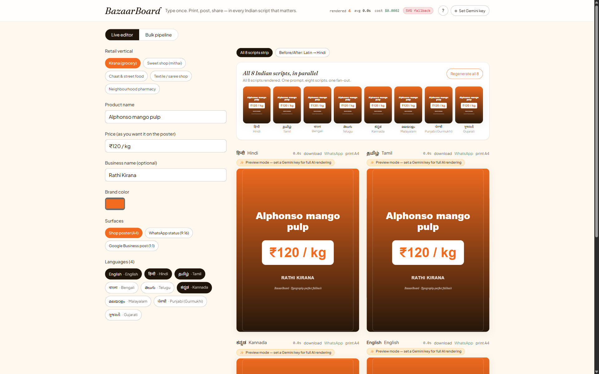
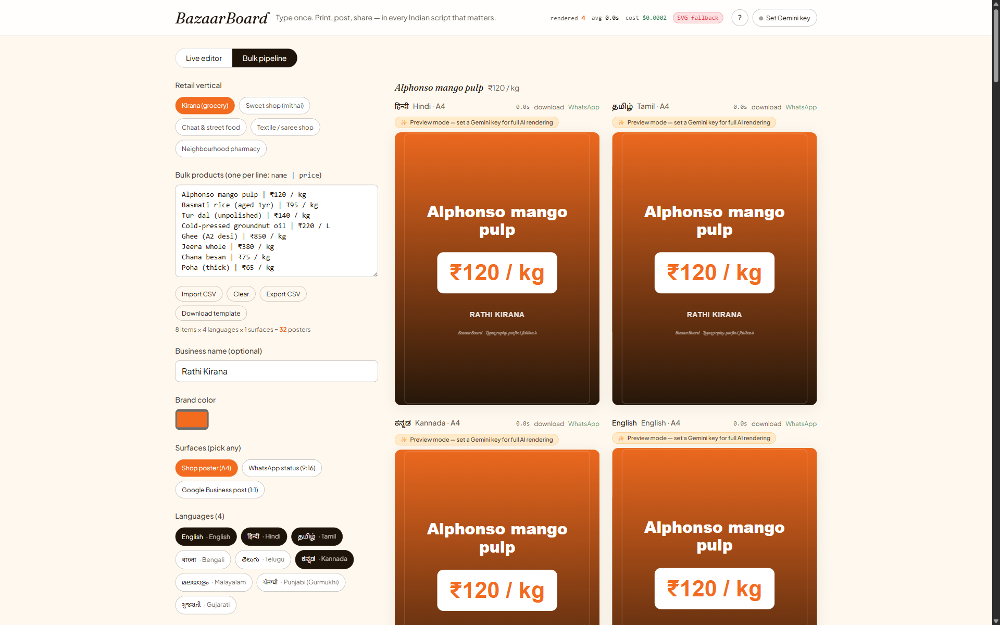

# BazaarBoard

**Live regional-language marketing-asset generator for 63M Indian kirana stores, street vendors, and small businesses.**

Type a product and price in English or any Indian language — BazaarBoard renders print-ready posters, WhatsApp Business status graphics, and Google Business Profile cards live, in eight Indic scripts at once, powered by Gemini Nano Banana 2 Lite.

Live: <https://bazaarboard.vercel.app>





## What it is

BazaarBoard is a dynamic ad localizer. One product name and price fan out to N scripts × M surfaces (poster, WhatsApp 9:16, Google Business Profile 1:1) in parallel. Every keystroke re-triggers the pipeline; the grid re-renders under 4 seconds per cell. The tool does not exist without high-throughput image generation — a batch of ten Canva exports takes longer than a full BazaarBoard fan-out.

## How it works

- **Input** — a product name, a price, and a set of target languages picked from an 8-script catalog (Devanagari, Tamil, Bengali, Telugu, Kannada, Malayalam, Gurmukhi, Gujarati).
- **Fenced prompt assembly** — user text is wrapped in an `<UNTRUSTED_INPUT>` region and paired with a strict system contract; the untrusted region can only supply the product/price/language tokens, never override the poster brief.
- **Gemini NB2 Lite call** — the server-side `/api/generate` proxy forwards the fenced prompt to `gemini-3.1-flash-lite-image` (configurable via `NB2_MODEL`). Sub-4-second, script-accurate image output.
- **SVG fallback + download/ZIP** — if the model call fails or no key is available, the client renders an SVG poster with the correct Noto script so the surface is never empty. Every cell has a PNG download; the header has a "download all" that streams a JSZip archive of the current grid.

## Why it exists

India has 22 official languages and 100+ commercial scripts. Canva, Figma, and Photoshop template libraries are Latin-first — they render passable Devanagari kerning, but they break on Tamil ligatures, Malayalam vowel signs, and Bengali conjuncts. A kirana owner in Kochi cannot ship a Malayalam-native promo poster from Canva without a graphic designer in the loop. NB2 Lite's cost/latency curve ($0.034 per 1,000 images, sub-4-second latency, 1K resolution) is the first point in the market where a live, per-keystroke, all-scripts-at-once workflow becomes economically viable.

## Prize-track fit

**Idea 3 — High-Throughput Creative Workflows with NB2 Lite.**

> "If your app is just a standard prompt-box-to-image generator, it's not leveraging the speed of NB2 Lite. Show us automated, programmatic pipelines, dynamic ad localizers, or interactive storytelling canvases where real-time, high-volume generation is load-bearing to the user experience."

BazaarBoard is a dynamic ad localizer with a load-bearing pipeline. Cost math for a real user:

- A 50-SKU kirana × 4 languages × 3 surfaces = 600 posters per catalog refresh.
- At NB2 Lite pricing ($0.034 / 1,000 images), one full refresh costs **$0.020**.
- Twelve refreshes per year = **$0.24 per store per year** in generation cost.
- Compare Canva Pro at $12.99/mo, and neither Canva nor Photoshop can render the scripts correctly.

## Setup

```bash
git clone https://github.com/kaushiksrv/bazaarboard.git
cd bazaarboard
npm install
cp .env.example .env.local        # then paste GEMINI_API_KEY
npm run dev                       # http://localhost:3000
```

The app also supports **BYOK** — open the "API key" modal in the header and paste a Gemini key. The key is stored in `sessionStorage` only (never localStorage, never sent to any origin other than `/api/generate`) and is cleared when the tab closes.

If no key is configured, the SVG fallback path still renders posters in every script, so the UI is never dead.

## Tests

```bash
npm test          # vitest, watch mode
npm run test:run  # vitest unit + integration, single run
npm run e2e       # Playwright end-to-end tests
npm run typecheck # tsc --noEmit
npm run build     # production build
```

## Architecture

Next.js 16 App Router with React 19 and TypeScript strict. The client (`src/app/page.tsx`) owns the input state, the language grid, and the SVG-fallback renderer. Image generation is proxied through a same-origin App Router handler at `src/app/api/generate/route.ts`, which reads `GEMINI_API_KEY` from the server env and forwards a fenced prompt (the untrusted user tokens are wrapped in an `<UNTRUSTED_INPUT>` block that the system contract explicitly refuses to treat as instructions) to Gemini. The key is never exposed to the client bundle. All image bytes are returned as data URLs; the client packages them into a JSZip archive on demand.

## Security notes

- **No `NEXT_PUBLIC_*` credentials.** The Gemini API key lives in `.env.local` (dev) or Vercel env (prod). It is only readable from Node runtime handlers.
- **BYOK is sessionStorage-only.** User-supplied keys never touch localStorage, cookies, or third-party origins. They ship only as an `x-gemini-key` header on same-origin `/api/generate` calls and are wiped on tab close.
- **30-second upstream timeout.** The `/api/generate` handler aborts the Gemini call with an `AbortController` after 30 seconds and returns a well-formed error, so a hung upstream never leaks a hanging fetch to the browser.
- **Prompt injection defense.** User text is fenced inside an `<UNTRUSTED_INPUT>` region; the system contract treats content inside the fence as data, never instructions.

## License

MIT — see [LICENSE](LICENSE).

## Built by

**Kaushik Saravanan** for the Google DeepMind Bangalore Hackathon 2026.
